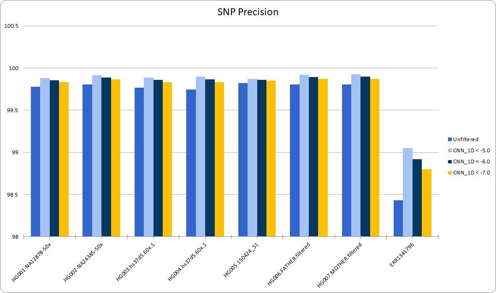
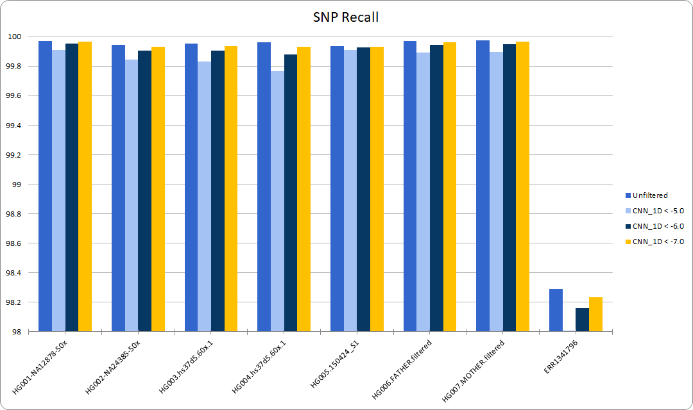
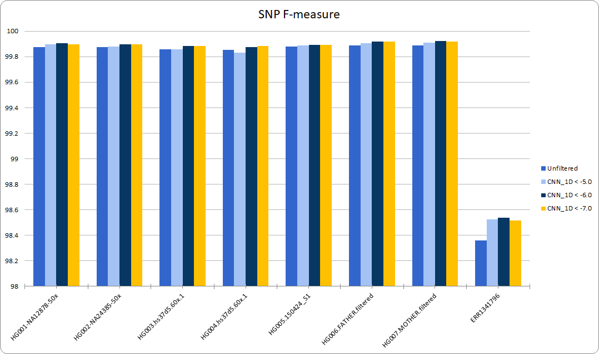
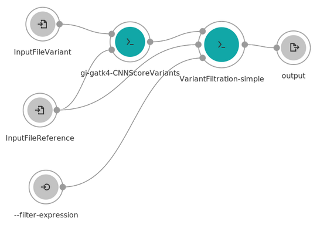

# Wrapping CNNScoreVariants in CWL with benchmarking
This school project was created for the [Computational Genomics (2018/2019) course][course], which is a part of the Master studies at the [School of Electrical Engineering][school], [University of Belgrade][uni]. A full description of the project statement is given below, along with an overview of the results. 

Authors: [Nikola Pejić][np] and [Dušan Đorić][dd]

Mentor: [Vladimir Kovačević][prof]

### Structure of the repository

The whole *"code"* of the project is located in the ```apps``` folder, and consists of the following files:

 - ```gi-gatk4-CNNScoreVariants.cwl``` - the CNNScoreVariants command with all of its parameters wrapped in CWL
 
 - ```VariantFiltration-simple.cwl``` - a simple version of the VariantFiltration command where only one filtering expression can be set, wrapped in CWL
 
 - ```CNNScoreVariants-with-VariantFiltration.cwl``` - a simple CWL workflow which consists of the two previous commands, where the output of the first one is passed on to the second one.
 
In order to open and edit the files, we recommend the [Rabix Composer][rabix] application.
 
The project statement and benchmarking results are located in the ```docs``` folder. It also contains the ```images``` folder where the images referenced by this ```README.md``` are stored.   

## Project statement
Project task is consisted of wrapping GATK4 [CNNScoreVariants][CNNScoreVariants] deep-learning based tool for variant filtering in [CWL][CWL] and running it with test samples. This project will be done on [Cancer Genomics Cloud][CGC] platform where anyone with academic email address can register and receive $300 free credit. The process of adaptation (wrapping) and running should be done in a similar way as described in [quickstart][quickstart] and in the [tutorials][tutorials] (pages: YOUR TOOL, TOOL WRAPPING TIPS AND TRICKS, RUN AN ANALYSIS). The [Docker][docker] image for the tool is available: ```images.sbgenomics.com/vladimirk/gatk:4.1.0.0``` and tool can be run from it with the command:

```
/gatk/gatk CNNScoreVariants
```

All parameters of the tool need to be supported (added as inputs) to be adjustable in the task. Successful end of this part of project considers completing filtering task on CGC platform with input VCF and BAM file from Public reference files. *(10 points)*

Second part of the project assignment is benchmark of the filtering results. The tool will be run on the set of provided samples with available truth set (HG001-HG007 + CHM11-CHM13). For all of these samples precision, recall and f-score should be calculated using all provided VCF Benchmark workflow, truth-set VCFs and confidence BED regions for each of the samples. The precision, recall and f-score results for all samples, for filtered and non-filtered variants should be added to the comparison table and bar diagrams should to be created. *(15 points)*

Create slides (Google Slides or Power point presentation) with summarized work being done and  record a 5-10 minute (upload to YouTube - optional) video which will present it to potential audience. *(15 points)*

The project will be done in a cooperation with [Vladimir Kovacevic][prof], who will be informed on the progress of the project and answer to all relevant questions or concerns. 

## Results

After experimenting with the command for some time, it turned out that the CNNScoreVariants command **does not filer variants**, but only annotates them by adding a new column called ```CNN_1D``` with the scores. So, the original project statement was altered to include finding a way to filter variants so that the resulting f-score was higher than originally. 

The **VariantFiltration** command was selected (and wrapped in CWL) in order to perform the filtering, and the expression on which it filtered was decided to be ```CNN_1D < <val>```, where ```<val>``` is a float which was changed while testing. The measurement results can be seen in [CNNScoreVariants - Variant filtering.xlsx][res] located in the ```docs``` folder. 
  
In short, we found that with the increase of the threshold the resulting *precision* grows, as shown in the chart below.

<p align="center">

</p>

However, that causes  the *recall* to shrink.

<p align="center">

</p>

That is why we focused  on the *f-score*, which peaks when ```<val>``` is around ```-6.0```.   
  
<p align="center">

</p>

### Workflow

As mentioned above, the final version of the app (on which the benchmarking was done) was a workflow which consists of the CNNScoreVariants and VariantFiltration commands, where the output of the first is passed on to the latter. A graphical representation of the workflow is shown below.

<p align="center">

</p>

### Presentation

A recording of the presentation of the project was made and is available on YouTube.

[](https://www.youtube.com/watch?v=xLTvRgHnWQ4)


[course]: https://github.com/vladimirkovacevic/gi-2019-etf
[school]: https://www.etf.bg.ac.rs/
[uni]: https://www.bg.ac.rs/
[np]: https://github.com/nikolapeja6
[dd]: https://github.com/dusandjoric995
[rabix]: http://rabix.io/
[CNNScoreVariants]: https://software.broadinstitute.org/gatk/documentation/tooldocs/current/org_broadinstitute_hellbender_tools_walkers_vqsr_CNNScoreVariants.php
[CWL]:https://www.commonwl.org/
[CGC]:http://www.cancergenomicscloud.org/
[quickstart]:https://docs.sevenbridges.com/docs/install-and-run-samtools-sort
[tutorials]:https://docs.sevenbridges.com/docs/the-tool-editor
[docker]:https://docs.sevenbridges.com/docs/docker-basics
[prof]:https://github.com/vladimirkovacevic
[res]: https://github.com/nikolapeja6/gi-proj-CNNScoreVariants/blob/master/docs/CNNScoreVariants%20-%20Variant%20filtering.xlsx
